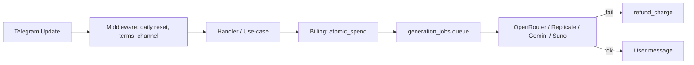

# Архитектура NeuroMule

## Поток запроса (упрощённо)

## Модули конфигурации

| Файл | Назначение |
|------|------------|
| `.env` | Секреты и переопределение цен (не в git) |
| `config.py` | `Settings` (pydantic-settings) |
| `business_catalog.py` | Каталог цен, пакетов, реестр сценариев |
| `services/billing/pricing.py` | Реэкспорт для billing-пайплайнов |

## Расширение без правки хэндлеров

1. **Видео** — `business_catalog.py` → `VIDEO_SCENARIO_ENTRIES` (+ промпт в `video_pipeline.SCENARIO_PROMPT_TEMPLATES`).
2. **Фото** — `PAID_IMAGE_MODEL_ENTRIES` + ветка в `generation_jobs._generate_photo_result`.
3. **Тариф магазина** — поля в `config.py` + блок в `catalog.shop_packs`.
4. **Цены** — переменные `COST_*` в `.env`.
